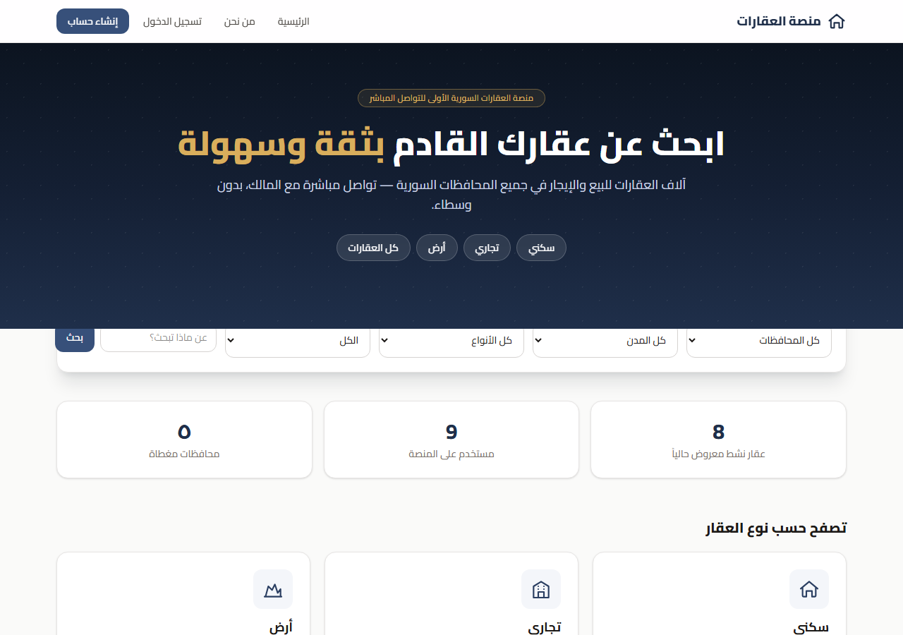
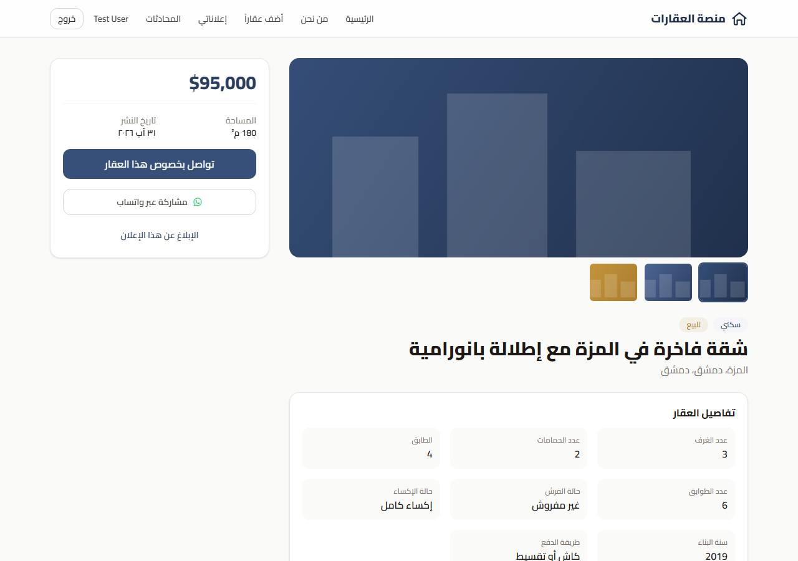
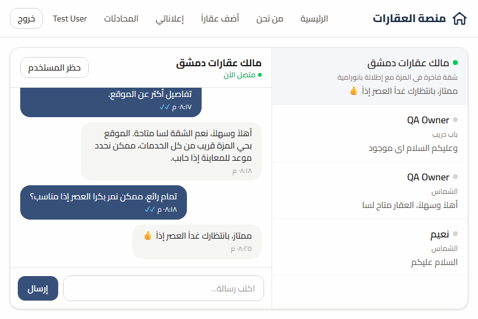
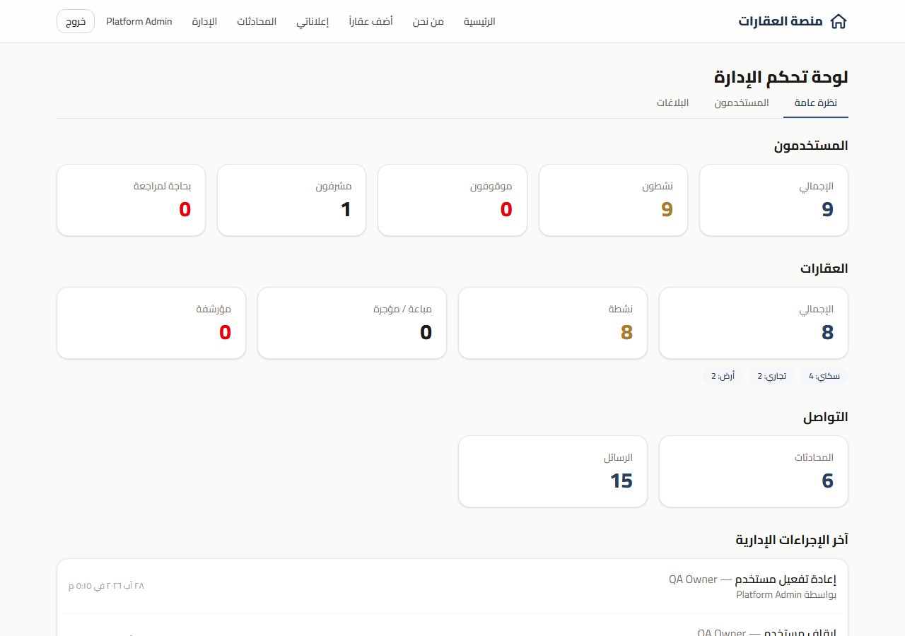
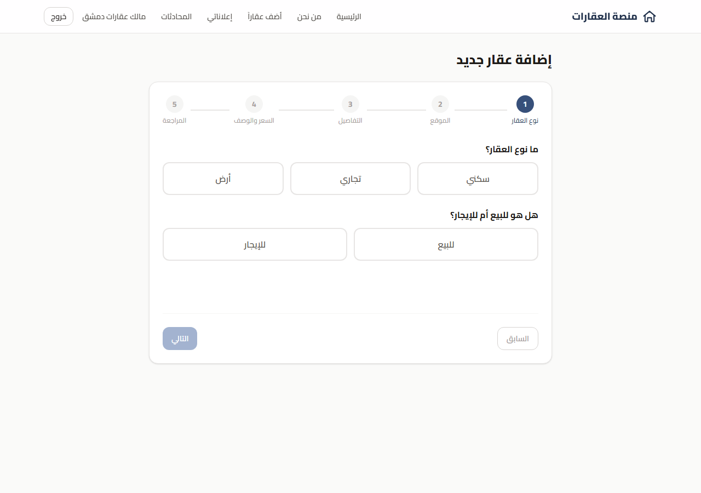

# منصة العقارات — Syrian Real Estate & Real-Time Chat Platform

A full-stack property portal for the Syrian real-estate market: search and list residential, commercial, and land properties, chat live with the owner over Socket.IO, and moderate the platform through a dedicated admin dashboard. Built end-to-end — schema, API, real-time layer, and a fully Arabic/RTL TypeScript frontend.


## لمحة عامة

منصة عقارات سورية تربط الباحث عن عقار بصاحبه مباشرة — بحث حسب المحافظة والمدينة ونوع العقار، تواصل لحظي عبر شات مباشر، وإدارة كاملة للإعلانات والمستخدمين والبلاغات من لوحة تحكم مخصصة.

## Screenshots

| | |
|---|---|
|  |  |
| **الصفحة الرئيسية** — بحث، فئات، إحصائيات حية | **تفاصيل العقار** — معرض صور، تواصل مباشر، مشاركة واتساب |
|  |  |
| **الشات اللحظي** — رسالة توصل فوراً بدون تحديث الصفحة | **لوحة الإدارة** — إحصائيات، مستخدمون، سجل تدقيق |
|  |  |
| **معالج إنشاء الإعلان** — 5 خطوات حسب نوع العقار | **صفحة من نحن** |

## Features

- **Listings** — residential / commercial / land, each with its own detail schema, dual SYP/USD pricing, up to 8 optional photos per listing.
- **Public search** — filter by governorate, city, property type, transaction type, and keyword; results paginated.
- **Real-time chat** — Socket.IO rooms per conversation, delivery + read receipts, online/last-seen presence, per-user rate limiting, block/unblock enforcement.
- **Moderation** — users can report a listing; admins review the queue and dismiss, archive, or permanently remove it. Every admin moderation action is written to an audit log automatically.
- **Admin dashboard** — platform-wide stats, user suspend/reinstate (with a required reason), report queue, recent-activity feed.
- **WhatsApp share** — one-tap share of any listing with a prefilled message, tuned for a market where WhatsApp dominates.

## Live Demo

_Deployment pending — see [system-architecture.md](system-architecture.md) for the planned zero-cost deployment target (Oracle Cloud Always Free)._

## Tech Stack

**Backend** — Node.js, Express, Socket.IO, MariaDB (`mysql2`, raw parameterized SQL, no ORM), JWT auth, `bcryptjs`, `multer` for uploads. Clean layering: `routes → controllers → services → repositories → models`.

**Frontend** — React 18, TypeScript (strict, zero `any`), Tailwind CSS v4, React Router, `socket.io-client`, Vite. No UI framework — every primitive (`Button`, `Modal`, `ConfirmDialog`, …) is hand-built and reused.

**Testing** — `node:test` + `supertest` for backend API integration tests (against the real Express app and a real database, not mocks); Vitest + React Testing Library for frontend unit/component tests.

## Engineering Decisions & Debugging Highlights

Real issues found and fixed while building this, not a hypothetical list — each one changed the code:

- **A silent data-loss bug in listing deletion.** `reports.reported_listing_id` has a foreign key with no `ON DELETE CASCADE` (and can't — a `CHECK` constraint requires every report to always point at exactly one target). That meant deleting *any* listing that had ever been reported — even a report resolved months earlier — failed with a raw `ER_ROW_IS_REFERENCED_2` from MariaDB, for every user, not just admins. Found it while writing an admin moderation test, fixed it by clearing dependent report rows before the delete, and verified with the exact scenario that triggered it.
- **A stale-auth false positive that looked like a real bug.** Testing block/unblock across two browser tabs of the same origin, one tab suddenly got "You cannot block yourself" — but the log clearly showed I was blocking someone else. Root cause: `localStorage` is shared across tabs of the same origin, so logging into a second tab silently swapped the first tab's auth token underneath its still-rendered UI. Not an app bug — but distinguishing that from a real one required tracing the actual JWT `sub` claim through both sessions, not just trusting what the UI displayed.
- **A silently swallowed error in the chat block button.** `handleToggleBlock` had a `try { … } finally { … }` with no `catch` — a failed block/unblock request left the user with zero feedback and an unhandled promise rejection in the console. Only surfaced because a test scenario happened to make the request fail; fixed by adding proper error state and a visible `Alert`.
- **Adapting the schema to the real database, not the assumed one.** The initial design targeted MySQL 8 (`utf8mb4_0900_ai_ci`, `FULLTEXT … WITH PARSER ngram`). The actual local dev target was MariaDB 10.4 (XAMPP), which supports neither — caught by actually running the migration, not by reviewing the SQL on paper. Fixed by moving to `utf8mb4_unicode_ci` and plain `LIKE` search.
- **A dependency-chain security fix.** `npm audit` flagged a critical vulnerability pulled in transitively through `bcrypt`'s native-binary installer (`node-pre-gyp` → a vulnerable `tar`). Swapped to `bcryptjs` — pure JS, same API, no native compile step, and it also removes the Windows build-tools requirement for local dev.
- **A deliberate, reversible trade-off on email verification.** The full verify-email flow (token issuance, `/auth/verify-email`, console-logged link) was built and worked. Once real users started hitting it in a `EMAIL_MODE=console` environment with no outbound mail, it was actively blocking onboarding. Rather than rip the feature out, the login-time enforcement was removed while the underlying flow stays intact — re-enabling it later (once real SMTP is wired up) is a three-line change, not a rebuild.

## Getting Started

```bash
git clone https://github.com/NaimMusaaga/real-estate-platform.git
cd real-estate-platform
```

See [backend/README.md](backend/README.md) and [frontend/README.md](frontend/README.md) for full setup instructions (env vars, migrations, seed data).

Quick version:

```bash
# Backend
cd backend && npm install
cp .env.example .env   # fill in local MySQL/MariaDB credentials
npm run migrate && npm run seed:admin && npm run seed:reference
npm run dev             # http://localhost:4000

# Frontend (separate terminal)
cd frontend && npm install
cp .env.example .env
npm run dev              # http://localhost:5173
```

## Running the Tests

```bash
cd backend && npm test    # node:test + supertest, against a real DB
cd frontend && npm test   # vitest
```

## Project Structure

```
backend/src/
  routes/ controllers/ services/ repositories/ models/   # clean-architecture layers
  sockets/                                                # Socket.IO handlers, presence, rate limiting
  database/                                                # schema.sql, migrations, seeds
  test/                                                     # node:test + supertest

frontend/src/
  pages/ components/ context/ hooks/ routes/               # screens & app shell
  services/api/                                             # typed REST clients
  types/                                                     # shared TS types, mirror backend JSON shapes
```
