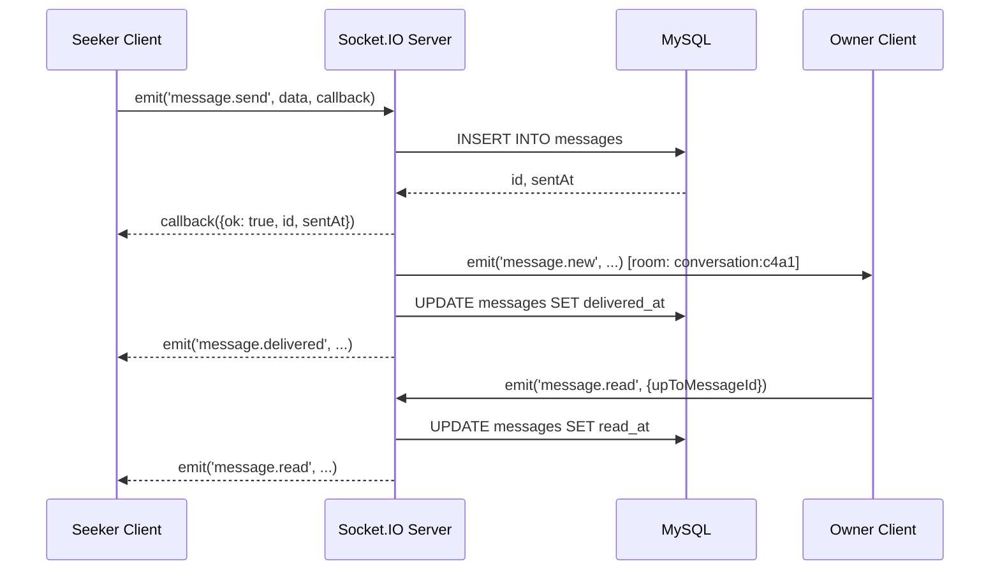
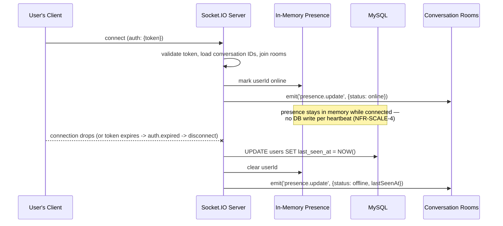

# API & WebSocket Contract — Syrian Real Estate Platform

**Phase:** Interface Design (builds on the [Requirements v2](./requirements-and-architecture-foundations.md) and [MySQL Database Design](./database-design.md))
**Status:** v2 — finalized. WebSocket layer built on **Socket.IO** (Node.js) per your decision; all four open items resolved.
**Scope:** Endpoint list + WebSocket event payloads only — no backend implementation code, per your instruction.

---

## 1. Conventions

| Concern | Convention |
|---|---|
| Base URL | `/api/v1/...` — versioned prefix from day one |
| Auth (REST) | `Authorization: Bearer <accessToken>` header, short-lived JWT access token + longer-lived refresh token |
| Auth (WebSocket) | **(v2)** Socket.IO's `auth` handshake payload — `io(url, { auth: { token } })` — not a raw `?token=` query string. This is the idiomatic Socket.IO pattern and keeps the token out of the URL that access logs would otherwise capture. |
| WebSocket library | **(v2 — decided)** [Socket.IO](https://socket.io/) — gives room-based broadcast (a natural fit for per-conversation channels), automatic reconnection with backoff, and transport fallback (WebSocket → HTTP long-polling) essentially for free, which matters given variable mobile network quality in the target market. |
| IDs | UUID strings everywhere, matching the `CHAR(36)` primary keys in the database |
| Timestamps | ISO-8601, always UTC (`"2026-08-26T14:03:00Z"`) |
| Errors (REST) | `{ "error": { "code": "SCREAMING_SNAKE_CASE", "message": "human-readable", "details"?: {...} } }` on every non-2xx response |
| Errors (WebSocket) | **(v2)** Returned through the Socket.IO acknowledgement callback of the action that failed — not a separate broadcast event. See §3.4. |
| Pagination — listings search | Page-based: `?page=1&limit=20`, response includes `{ "items": [...], "page": 1, "limit": 20, "totalCount": 342 }` |
| Pagination — messages & notifications | Cursor-based: `?before=<ISO timestamp>&limit=50` |
| Chat rate limit | **(v2 — tightened)** 10 `message.send` events per 10 seconds per user (was proposed at 20, tightened per your call — spam headroom matters more than burst-typing convenience for a real-estate inquiry chat) |

---

## 2. REST API Endpoints

### 2.1 Auth

| Method | Path | Auth | Description |
|---|---|---|---|
| POST | `/auth/register` | — | Create account (FR-UM-1) |
| POST | `/auth/verify-email` | — | Consume verification token (FR-UM-2) |
| POST | `/auth/resend-verification` | — | Re-send verification email |
| POST | `/auth/login` | — | Returns access + refresh tokens; `403 EMAIL_NOT_VERIFIED` if unverified |
| POST | `/auth/refresh` | — | Exchange a refresh token for a new access token — this is also what the client calls right after a WebSocket gets disconnected for an expired token (§3.1) |
| POST | `/auth/logout` | ✅ | Invalidates the current refresh token |
| POST | `/auth/password/forgot` | — | Always `204`, regardless of whether the email exists |
| POST | `/auth/password/reset` | — | Consume reset token, set new password |

**`POST /auth/register`**
```json
// Request
{ "email": "amal@example.com", "password": "•••••••", "displayName": "Amal Haddad" }
// 201 Response
{ "userId": "5b1e...9a2f", "status": "pending_verification" }
```

### 2.2 Users

| Method | Path | Auth | Description |
|---|---|---|---|
| GET | `/users/me` | ✅ | Own full profile |
| PATCH | `/users/me` | ✅ | Update display name / phone / photo (FR-UM-5) |
| GET | `/users/{userId}` | — | Public profile (FR-UM-6) — Guests allowed |
| POST | `/users/{userId}/block` | ✅ | Block a user (FR-CH-11) |
| DELETE | `/users/{userId}/block` | ✅ | Unblock |
| GET | `/admin/users` | 🛡️ Admin | List/filter accounts, incl. `?flagged=true` for the soft-cap queue (FR-UM-9) |
| PATCH | `/admin/users/{userId}/suspend` | 🛡️ Admin | Body: `{ "reason": "..." }` (FR-UM-7) |
| PATCH | `/admin/users/{userId}/reinstate` | 🛡️ Admin | |

### 2.3 Reference Data

| Method | Path | Auth | Description |
|---|---|---|---|
| GET | `/governorates` | — | Fixed list (FR-PL-1) |
| GET | `/governorates/{governorateId}/cities` | — | Dependent dropdown (FR-PL-2) |
| GET | `/amenities` | — | Tag list for listing forms and search filters |
| POST/PATCH/DELETE | `/admin/governorates[/​{id}]` | 🛡️ Admin | Reference data management (FR-PL-4) |
| POST/PATCH/DELETE | `/admin/cities[/​{id}]` | 🛡️ Admin | |
| POST/PATCH/DELETE | `/admin/amenities[/​{id}]` | 🛡️ Admin | |

### 2.4 Listings

| Method | Path | Auth | Description |
|---|---|---|---|
| GET | `/listings` | — | Search/filter/sort (FR-SF-1–8) — see query params below |
| GET | `/listings/{listingId}` | — | Full detail view |
| POST | `/listings` | ✅ verified | Create (FR-PL-6–10) |
| PATCH | `/listings/{listingId}` | ✅ owner/admin | Edit, no re-moderation (FR-PL-13) |
| DELETE | `/listings/{listingId}` | ✅ owner/admin | Permanent delete (FR-PL-14) |
| PATCH | `/listings/{listingId}/status` | ✅ owner | Body: `{ "status": "sold_rented" \| "active" }` |
| POST | `/listings/{listingId}/photos` | ✅ owner | **(confirmed)** direct `multipart/form-data` upload, streamed through the app server to its local upload folder — no pre-signed/cloud-storage flow for MVP (FR-PL-11) |
| DELETE | `/listings/{listingId}/photos/{photoId}` | ✅ owner | |
| PATCH | `/listings/{listingId}/photos/{photoId}/cover` | ✅ owner | Sets this photo as the cover |
| POST | `/listings/{listingId}/report` | ✅ | Body: `{ "reason": "...", "description"?: "..." }` (FR-PL-15) |
| PATCH | `/admin/listings/{listingId}/archive` | 🛡️ Admin | Body: `{ "reason": "..." }`, audit-logged (FR-PL-16) |

**`GET /listings` query parameters**

| Param | Example | Notes |
|---|---|---|
| `governorateId`, `cityId` | `?governorateId=4&cityId=112` | FR-SF-2 |
| `propertyType`, `transactionType` | `?propertyType=residential&transactionType=rent` | FR-SF-3 |
| `priceCurrency`, `priceMin`, `priceMax` | `?priceCurrency=USD&priceMin=50000&priceMax=80000` | Applies the reference-rate hybrid match (FR-SF-4) |
| `areaMin`, `areaMax` | `?areaMin=80&areaMax=150` | FR-SF-5 |
| `bedroomsMin`, `bathroomsMin` | `?bedroomsMin=2` | residential only |
| `amenities` | `?amenities=parking,elevator` | FR-SF-6 |
| `q` | `?q=دمر` | keyword search over title/description (FR-SF-1) |
| `sort` | `?sort=price_asc` | `newest` (default) \| `price_asc` \| `price_desc` (FR-SF-7) |
| `page`, `limit` | `?page=2&limit=20` | FR-SF-8 |

**`POST /listings` (residential example — body shape varies by `propertyType`)**
```json
{
  "propertyType": "residential",
  "transactionType": "rent",
  "title": "شقة مفروشة في المزة",
  "description": "...",
  "priceSyp": 3500000,
  "priceUsd": null,
  "areaSqm": 120,
  "governorateId": 4,
  "cityId": 112,
  "neighborhood": "المزة",
  "addressDetail": "قرب جسر الرئيس، بناء 12، طابق 3",
  "amenityIds": [1, 4, 7],
  "residentialDetails": {
    "bedrooms": 3,
    "bathrooms": 2,
    "floorNumber": 3,
    "totalFloors": 6,
    "furnishingStatus": "furnished",
    "buildingYear": 2015,
    "finishingCondition": "fully_finished",
    "paymentTerms": "cash"
  }
}
```

### 2.5 Favorites

| Method | Path | Auth | Description |
|---|---|---|---|
| GET | `/favorites` | ✅ | List saved listings (FR-FAV-2) |
| PUT | `/favorites/{listingId}` | ✅ | Save (idempotent) (FR-FAV-1) |
| DELETE | `/favorites/{listingId}` | ✅ | Unsave |

### 2.6 Conversations (REST side — sending live messages happens over Socket.IO, §3)

| Method | Path | Auth | Description |
|---|---|---|---|
| GET | `/conversations` | ✅ | List with last-message preview (FR-CH-5) |
| POST | `/conversations` | ✅ | Body: `{ "listingId": "..." }` — finds existing or creates new thread (FR-CH-1/2) |
| GET | `/conversations/{conversationId}/messages` | ✅ participant | Cursor-paginated history (FR-CH-6) |
| POST | `/conversations/{conversationId}/report` | ✅ participant | Reports the thread itself (FR-CH-7), unlocks admin content view |

### 2.7 Notifications

| Method | Path | Auth | Description |
|---|---|---|---|
| GET | `/notifications` | ✅ | Cursor-paginated, `?unreadOnly=true` supported (FR-NT-4) |
| PATCH | `/notifications/{notificationId}/read` | ✅ | |
| PATCH | `/notifications/read-all` | ✅ | |

### 2.8 Admin — Trust & Safety

| Method | Path | Auth | Description |
|---|---|---|---|
| GET | `/admin/reports` | 🛡️ Admin | `?status=pending`, queue view (UC-5) |
| GET | `/admin/reports/{reportId}` | 🛡️ Admin | Includes full conversation content **only** when `reportedConversationId` is set — enforces NFR-SEC-8 at the API layer |
| PATCH | `/admin/reports/{reportId}/resolve` | 🛡️ Admin | Body: `{ "action": "dismiss"\|"remove_listing"\|"archive_listing"\|"suspend_user", "note": "..." }` — writes an `admin_audit_logs` row |
| GET | `/admin/exchange-rate` | 🛡️ Admin | Current reference rate |
| PUT | `/admin/exchange-rate` | 🛡️ Admin | Body: `{ "usdToSypRate": 14500.0 }` — appends a new row, never overwrites history |
| GET | `/admin/audit-logs` | 🛡️ Admin | Filterable by admin, target table, date range |

---

## 3. WebSocket Contract (Socket.IO)

### 3.1 Connection & Authentication

```js
// Client
const socket = io("https://api.example.com", { auth: { token: accessToken } });
```

On connection, a Socket.IO middleware on the server validates the token (`io.use((socket, next) => {...})`) before the connection is accepted. Once accepted, the server:

1. Resolves the user from the token.
2. Loads every `conversation.id` where the user is `seeker_id` or `owner_id`.
3. Joins the socket to Socket.IO **rooms**: `user:{userId}` (personal — carries notifications) and `conversation:{conversationId}` for each thread found in step 2. Rooms are Socket.IO's native grouping mechanism, and they map directly onto the "channel" concept from the v1 draft of this contract — no custom pub/sub bookkeeping needed at MVP's single-instance scale.
4. Marks the user "online" in an **in-memory** presence store (never written to MySQL per heartbeat — database design note on `NFR-SCALE-4`).
5. Broadcasts `presence.update` (online) to every `conversation:{id}` room the user just joined: `io.to(room).emit(...)`.
6. Emits `connection.ready` back to the connecting socket only.

**Token expiry mid-connection (v2 — decided):** kept intentionally simple. When the server detects an expired token (either at reconnect-time middleware, or via a periodic validity check on long-lived connections), it emits `auth.expired` to that socket and then calls `socket.disconnect(true)`. The client's only job on receiving `auth.expired` is: call `POST /auth/refresh` over plain HTTP, then reconnect the socket with the new token. No in-band token-refresh event on the socket itself — the client always drops to a clean HTTP call and a fresh connection.

On disconnect (any reason), the server writes `users.last_seen_at = NOW()` (the *only* presence-related database write), removes the socket from its rooms, clears the in-memory presence marker, and broadcasts `presence.update` (offline) to the same rooms.

Socket.IO's client handles reconnection (exponential backoff, transport fallback to HTTP long-polling if a WebSocket upgrade is blocked) automatically — this covers NFR-AVAIL-2 without custom client logic. What Socket.IO does **not** do is replay events broadcast while a client was disconnected; that gap is always closed by the REST catch-up described in §3.5.

### 3.2 Event Shape

Socket.IO events are `(eventName, payload)` pairs — no manual envelope object is needed (unlike the transport-agnostic draft in v1 of this document, which had to invent one). Two calling patterns are used below:

- **Fire-and-forget**: `socket.emit('eventName', payload)` — used for server → client broadcasts.
- **Acknowledged**: `socket.emit('eventName', payload, callback)` — used for the one client → server action that needs a definite success/failure response (`message.send`). The server's `callback(response)` call *is* the acknowledgement; no separate ack event exists.

### 3.3 Client → Server Events

**`message.send`** — send a chat message (acknowledged)
```js
socket.emit('message.send', {
  conversationId: 'c4a1...',
  clientMessageId: 'tmp-98213',   // for optimistic-UI reconciliation and de-dup on retry
  body: 'هل السعر قابل للتفاوض؟'
}, (response) => {
  // response.ok === true  -> { ok: true, id: 'm7f2...', sentAt: '2026-08-26T14:03:00Z' }
  // response.ok === false -> { ok: false, error: { code: 'BLOCKED', message: '...' } }
});
```
Server validates: sender is a participant in `conversationId`, neither party has blocked the other (FR-CH-11 / NFR-SEC-9), `body` is non-empty, and the sender hasn't exceeded 10 sends/10s (§1). On success, persists the message, invokes the callback with `{ ok: true, id, sentAt }`, and broadcasts `message.new` to the conversation room. On failure, invokes the callback with `{ ok: false, error }` — the client never has to guess whether a send worked.

**`message.read`** — mark messages read up to a point (fire-and-forget)
```js
socket.emit('message.read', { conversationId: 'c4a1...', upToMessageId: 'm7f2...' });
```
Server sets `read_at` on all of the *other* participant's messages in that thread up to and including `upToMessageId`, then broadcasts `message.read` to the conversation room.

### 3.4 Server → Client Events

**`connection.ready`** *(to the connecting socket only)*
```json
{ "userId": "5b1e...", "subscribedConversations": ["c4a1...", "c9b0..."] }
```

**`message.new`** *(broadcast to `conversation:{id}`)*
```json
{
  "id": "m7f2...",
  "conversationId": "c4a1...",
  "senderId": "5b1e...",
  "body": "هل السعر قابل للتفاوض؟",
  "sentAt": "2026-08-26T14:03:00Z"
}
```

**`message.delivered`** *(broadcast to `conversation:{id}`, fired once the recipient's socket has received `message.new`)*
```json
{ "conversationId": "c4a1...", "messageId": "m7f2...", "deliveredAt": "2026-08-26T14:03:01Z" }
```

**`message.read`** *(broadcast to `conversation:{id}`, so the original sender's UI updates its read-receipt mark)*
```json
{ "conversationId": "c4a1...", "readerId": "9d3c...", "upToMessageId": "m7f2...", "readAt": "2026-08-26T14:05:12Z" }
```

**`presence.update`** *(broadcast to `conversation:{id}`)*
```json
{ "userId": "9d3c...", "status": "offline", "lastSeenAt": "2026-08-26T14:10:00Z" }
```
(`lastSeenAt` is omitted when `status` is `"online"`.)

**`notification.new`** *(to `user:{id}` only)*
```json
{
  "id": "n551...",
  "type": "new_message",
  "relatedConversationId": "c4a1...",
  "messagePreview": "هل السعر قابل للتفاوض؟",
  "createdAt": "2026-08-26T14:03:00Z"
}
```

**`auth.expired`** *(to the connecting socket only, immediately before the server calls `socket.disconnect(true)`)*
```json
{ "message": "Session expired, please refresh and reconnect." }
```

### 3.5 Reconnection & Missed-Event Sync

The socket is a **live push channel only** — it never replays events broadcast while a client was disconnected. Catch-up is always the REST layer's job:

1. Socket.IO's client auto-reconnects (backoff + transport fallback built in).
2. On reconnect, the handshake in §3.1 runs again and the client re-syncs via REST: `GET /conversations/{id}/messages?before=<lastKnownMessageAt>` per open thread, and `GET /notifications?unreadOnly=true` for anything missed.
3. This is the same mechanism that already satisfies FR-CH-4 ("message sent while offline is shown on next visit") — live and reconnect-catch-up paths converge on the same REST endpoints, so there's one source of truth for history, not two to keep in sync.

---

## 4. Sequence Diagrams


*A message's full round trip: the callback confirms the send directly to its sender, the room broadcast pushes it to the recipient, then delivered and read events fire as the recipient's client receives and views it — four distinct state transitions, so the sender's UI can show the right tick mark at each stage.*


*Presence only touches the database twice per session — never on every heartbeat — while still leaving a durable "last seen" trail once the socket actually closes, whether that's a network drop or a forced disconnect from an expired token.*

---

## 5. Status

All four open items from v1 are resolved and reflected above: forced-reconnect on token expiry, Socket.IO as the WebSocket library (with its rooms, ack-callbacks, and built-in reconnection now shaping the whole contract in §3), a tightened 10-messages/10s rate limit, and confirmed direct multipart uploads to local storage. Nothing outstanding from this phase.

---

*Next: high-level system architecture diagram, in a companion document.*
