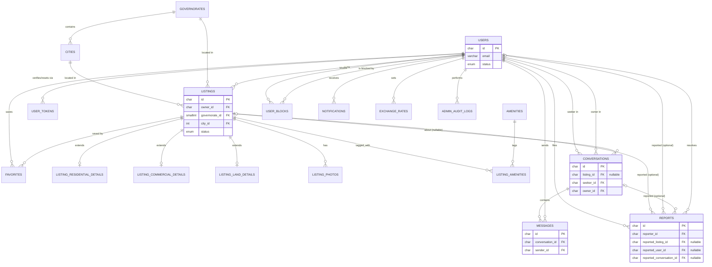

# Database Design — Syrian Real Estate Platform

**Phase:** Database Design (builds on [Requirements & Architecture Foundations v2](./requirements-and-architecture-foundations.md))
**Engine:** MariaDB 10.4 (what XAMPP actually bundles as "MySQL" — confirmed by running the migration against it)
**Status:** v4 — two corrections, both found by actually running the schema, not by review: `users.role` was missing (v3), and the schema assumed real MySQL 8 when the local dev target is MariaDB, which broke on two MySQL-8-only features.

**What changed from the MySQL 8 draft:**
- `utf8mb4_0900_ai_ci` → `utf8mb4_unicode_ci` everywhere. The `_0900_` collations are a MySQL 8 feature (its newer Unicode-aware collation set); MariaDB doesn't ship them and migration failed outright with `Unknown collation`. `utf8mb4_unicode_ci` is the accent/case-aware collation both engines actually support.
- The `FULLTEXT ... WITH PARSER ngram` index on `listings` is **removed**, not just changed. MariaDB has no `ngram` parser plugin at all — this wasn't a tuning mismatch, the feature doesn't exist there. Keyword search (FR-SF-1) now runs as a plain `LIKE '%term%'` query in the repository layer instead. That's a genuine simplification, not a workaround: at MVP scale (hundreds of listings), `LIKE` is fast enough, needs no server-side parser configuration, and behaves identically on any MySQL-family engine. Fancier search is explicitly a later-version concern if it ever becomes one.
- Everything else — `CHECK` constraints, `STORED` generated columns (the one-cover-photo trick), all the table structures and indexes — works unmodified on MariaDB 10.4 and has been verified by actually running `schema.sql` against it.

---

## 1. Design Notes Specific to This Phase

1. **Nullable prices, enforced at the DB level** (confirmed): `price_syp` and `price_usd` are both nullable with a `CHECK` requiring at least one — manual entry per currency, never both mandatory. See `listings` below.
2. **UUID primary keys are generated in the application layer**, not by MySQL. Unlike Postgres's `gen_random_uuid()` default, MySQL has no clean, version-stable equivalent for use as a column default — `UUID()` as a default expression is non-deterministic and its support/behavior has shifted across 8.0 point releases. Every UUID column below is `CHAR(36)`, and the application must generate a UUIDv4 and supply it on `INSERT`. This is standard practice for MySQL and also makes the ID available to application code *before* the insert (useful for the `conversations`/`messages` flow in the API doc that follows).
3. **`utf8mb4` / `utf8mb4_unicode_ci` on every table, no exceptions.** This is the single most consequential MySQL-specific decision for an Arabic-only platform: the legacy `utf8` alias in MySQL is actually a 3-byte encoding that cannot represent the full Unicode range and silently mangles some text; `utf8mb4` is the real, full 4-byte UTF-8. Getting this wrong is a classic, hard-to-notice-until-production bug for non-Latin-script apps, so it's called out explicitly rather than left to a server default that might disagree.
4. **MySQL has no partial indexes** (no `WHERE` clause on `CREATE INDEX`, unlike the Postgres draft). Two different adaptations were needed:
   - Indexes that existed only to keep an index small for `status = 'active'` queries (e.g., the main listings search index) now lead with the `status` column instead — slightly larger indexes, still selective, functionally equivalent at MVP scale.
   - The one genuine *constraint* that relied on a partial unique index — "only one cover photo per listing" — needed a different trick: a `STORED` generated column (`cover_slot`) that evaluates to `listing_id` when `is_cover = TRUE` and `NULL` otherwise, with a plain unique index on that generated column. MySQL unique indexes treat every `NULL` as distinct (same as Postgres), so non-cover photos never collide, and only one true cover row can exist per `listing_id`. See `listing_photos` below.
5. **Keyword search is a plain `LIKE '%term%'` query in the repository layer — no index-level trick at all.** The original plan here was a `FULLTEXT` index with MySQL 8's `ngram` parser (to sidestep English-oriented stemming for Arabic text). That plan didn't survive contact with the real engine: MariaDB — what's actually running, per the v4 correction above — has no `ngram` parser plugin, full stop. Rather than chase a different fulltext workaround, this fell back to the simplest thing that satisfies FR-SF-1: `LIKE` is portable across any MySQL-family engine, needs zero server configuration, and is plenty fast at MVP scale (hundreds of listings). A real search engine is a legitimate future-version upgrade if this ever stops being good enough — not a day-one concern.
6. **All datetimes are `DATETIME`, stored in UTC by application convention.** MySQL's `TIMESTAMP` type auto-converts to the session time zone and is range-limited to 2038; `DATETIME` has neither issue but also carries no timezone awareness of its own — so "always write and read UTC" is an application-layer rule this schema depends on, not something MySQL enforces for you.
7. **`payment_terms` now appears on all three type-specific detail tables** (residential, commercial, land), extended per your instruction — installment sales aren't residential-only in practice.
8. Everything else — the table-per-subtype pattern for listing details, the nullable `conversations.listing_id` with snapshot title, read receipts living directly on `messages`, presence being memory-resident rather than DB-written per heartbeat, the append-only `exchange_rates` history — carries over unchanged from the v1 rationale.

---

## 2. Entity-Relationship Diagram



---

## 3. Reference & Lookup Tables

```sql
CREATE TABLE governorates (
    id          SMALLINT UNSIGNED NOT NULL AUTO_INCREMENT,
    name_ar     VARCHAR(100) NOT NULL,
    sort_order  SMALLINT NOT NULL DEFAULT 0,
    is_active   BOOLEAN NOT NULL DEFAULT TRUE,
    PRIMARY KEY (id)
) ENGINE=InnoDB DEFAULT CHARSET=utf8mb4 COLLATE=utf8mb4_unicode_ci;

CREATE TABLE cities (
    id              INT UNSIGNED NOT NULL AUTO_INCREMENT,
    governorate_id  SMALLINT UNSIGNED NOT NULL,
    name_ar         VARCHAR(100) NOT NULL,
    is_active       BOOLEAN NOT NULL DEFAULT TRUE,
    PRIMARY KEY (id),
    CONSTRAINT fk_cities_governorate FOREIGN KEY (governorate_id) REFERENCES governorates(id),
    UNIQUE KEY uq_cities_gov_name (governorate_id, name_ar)
) ENGINE=InnoDB DEFAULT CHARSET=utf8mb4 COLLATE=utf8mb4_unicode_ci;
CREATE INDEX idx_cities_governorate ON cities(governorate_id);

CREATE TABLE amenities (
    id        SMALLINT UNSIGNED NOT NULL AUTO_INCREMENT,
    name_ar   VARCHAR(100) NOT NULL,
    slug      VARCHAR(50) NOT NULL,             -- e.g. 'solar_generator', 'water_well'
    is_active BOOLEAN NOT NULL DEFAULT TRUE,
    PRIMARY KEY (id),
    UNIQUE KEY uq_amenities_slug (slug)
) ENGINE=InnoDB DEFAULT CHARSET=utf8mb4 COLLATE=utf8mb4_unicode_ci;
```

---

## 4. Core Domain Tables

```sql
CREATE TABLE users (
    id                   CHAR(36) NOT NULL,                     -- app-generated UUIDv4
    email                VARCHAR(255) NOT NULL,
    password_hash        VARCHAR(255) NOT NULL,
    display_name         VARCHAR(100) NOT NULL,
    phone                VARCHAR(20),
    profile_photo_url    VARCHAR(500),
    email_verified_at    DATETIME,                              -- NULL = unverified (FR-UM-2)
    role                 ENUM('user','admin') NOT NULL DEFAULT 'user',  -- v3 fix: enforces the Guest/User/Admin permission model
    status               ENUM('active','suspended') NOT NULL DEFAULT 'active',
    listing_flag_status  ENUM('normal','flagged_for_review') NOT NULL DEFAULT 'normal',  -- FR-UM-9
    last_seen_at         DATETIME,                               -- durable presence fallback (NFR-SCALE-4)
    created_at           DATETIME NOT NULL DEFAULT CURRENT_TIMESTAMP,
    updated_at           DATETIME NOT NULL DEFAULT CURRENT_TIMESTAMP ON UPDATE CURRENT_TIMESTAMP,
    PRIMARY KEY (id),
    UNIQUE KEY uq_users_email (email)
) ENGINE=InnoDB DEFAULT CHARSET=utf8mb4 COLLATE=utf8mb4_unicode_ci;
-- utf8mb4_unicode_ci is accent/case-insensitive, so this unique key is already
-- effectively case-insensitive on email without a separate lower(email) index.
CREATE INDEX idx_users_flagged ON users(listing_flag_status);

CREATE TABLE user_tokens (
    id          CHAR(36) NOT NULL,
    user_id     CHAR(36) NOT NULL,
    token_type  ENUM('email_verification','password_reset') NOT NULL,
    token_hash  VARCHAR(255) NOT NULL,          -- never store the raw token
    expires_at  DATETIME NOT NULL,
    used_at     DATETIME,
    created_at  DATETIME NOT NULL DEFAULT CURRENT_TIMESTAMP,
    PRIMARY KEY (id),
    CONSTRAINT fk_user_tokens_user FOREIGN KEY (user_id) REFERENCES users(id) ON DELETE CASCADE,
    UNIQUE KEY uq_user_tokens_hash (token_hash)
) ENGINE=InnoDB DEFAULT CHARSET=utf8mb4 COLLATE=utf8mb4_unicode_ci;
CREATE INDEX idx_user_tokens_user ON user_tokens(user_id, token_type);


CREATE TABLE listings (
    id               CHAR(36) NOT NULL,
    owner_id         CHAR(36) NOT NULL,
    property_type    ENUM('residential','commercial','land') NOT NULL,
    transaction_type ENUM('sale','rent') NOT NULL,
    title            VARCHAR(150) NOT NULL,
    description      TEXT NOT NULL,
    price_syp        DECIMAL(14,2),             -- nullable: see design note #1
    price_usd        DECIMAL(12,2),             -- nullable: see design note #1
    area_sqm         DECIMAL(10,2) NOT NULL,
    governorate_id   SMALLINT UNSIGNED NOT NULL,
    city_id          INT UNSIGNED NOT NULL,
    neighborhood     VARCHAR(150) NOT NULL,     -- free text (FR-PL-3)
    address_detail   TEXT,                      -- free text (FR-PL-3)
    status           ENUM('active','sold_rented','archived') NOT NULL DEFAULT 'active',
    created_at       DATETIME NOT NULL DEFAULT CURRENT_TIMESTAMP,
    updated_at       DATETIME NOT NULL DEFAULT CURRENT_TIMESTAMP ON UPDATE CURRENT_TIMESTAMP,
    PRIMARY KEY (id),
    CONSTRAINT fk_listings_owner FOREIGN KEY (owner_id) REFERENCES users(id),
    CONSTRAINT fk_listings_governorate FOREIGN KEY (governorate_id) REFERENCES governorates(id),
    CONSTRAINT fk_listings_city FOREIGN KEY (city_id) REFERENCES cities(id),
    CONSTRAINT chk_listing_has_a_price CHECK (price_syp IS NOT NULL OR price_usd IS NOT NULL)
) ENGINE=InnoDB DEFAULT CHARSET=utf8mb4 COLLATE=utf8mb4_unicode_ci;

-- status leads: MySQL has no partial index, so the most selective, most-filtered
-- column goes first in the composite index instead (design note #4)
CREATE INDEX idx_listings_search ON listings(status, governorate_id, city_id, property_type, transaction_type);
CREATE INDEX idx_listings_price_usd ON listings(status, price_usd);
CREATE INDEX idx_listings_price_syp ON listings(status, price_syp);
CREATE INDEX idx_listings_owner_created ON listings(owner_id, created_at);   -- "my listings" + soft-cap count (FR-PL-17)
-- No index for keyword search: FR-SF-1 is a plain LIKE '%term%' in the repository layer (design note #5)


CREATE TABLE listing_residential_details (
    listing_id           CHAR(36) NOT NULL,
    bedrooms             SMALLINT NOT NULL,
    bathrooms            SMALLINT NOT NULL,
    floor_number         SMALLINT,              -- nullable: villas may not have one
    total_floors         SMALLINT,
    furnishing_status    ENUM('furnished','unfurnished','semi_furnished') NOT NULL,
    building_year        SMALLINT,
    finishing_condition  ENUM('unfinished','semi_finished','fully_finished') NOT NULL,  -- حالة الإكساء
    payment_terms        ENUM('cash','installments','both') NOT NULL DEFAULT 'cash',    -- طريقة الدفع
    PRIMARY KEY (listing_id),
    CONSTRAINT fk_res_details_listing FOREIGN KEY (listing_id) REFERENCES listings(id) ON DELETE CASCADE
) ENGINE=InnoDB DEFAULT CHARSET=utf8mb4 COLLATE=utf8mb4_unicode_ci;

CREATE TABLE listing_commercial_details (
    listing_id          CHAR(36) NOT NULL,
    commercial_subtype  ENUM('shop','office','warehouse','other') NOT NULL,
    floor_number        SMALLINT,
    frontage_notes       TEXT,
    payment_terms        ENUM('cash','installments','both') NOT NULL DEFAULT 'cash',   -- extended per your instruction
    PRIMARY KEY (listing_id),
    CONSTRAINT fk_com_details_listing FOREIGN KEY (listing_id) REFERENCES listings(id) ON DELETE CASCADE
) ENGINE=InnoDB DEFAULT CHARSET=utf8mb4 COLLATE=utf8mb4_unicode_ci;

CREATE TABLE listing_land_details (
    listing_id           CHAR(36) NOT NULL,
    zoning_notes         TEXT,
    utilities_connected  BOOLEAN NOT NULL DEFAULT FALSE,
    payment_terms        ENUM('cash','installments','both') NOT NULL DEFAULT 'cash',   -- extended per your instruction
    PRIMARY KEY (listing_id),
    CONSTRAINT fk_land_details_listing FOREIGN KEY (listing_id) REFERENCES listings(id) ON DELETE CASCADE
) ENGINE=InnoDB DEFAULT CHARSET=utf8mb4 COLLATE=utf8mb4_unicode_ci;

CREATE TABLE listing_photos (
    id          CHAR(36) NOT NULL,
    listing_id  CHAR(36) NOT NULL,
    url         VARCHAR(500) NOT NULL,           -- points at server storage/upload folder, no blobs (per your instruction)
    sort_order  SMALLINT NOT NULL DEFAULT 0,
    is_cover    BOOLEAN NOT NULL DEFAULT FALSE,
    cover_slot  CHAR(36) GENERATED ALWAYS AS (CASE WHEN is_cover THEN listing_id END) STORED,  -- design note #4
    created_at  DATETIME NOT NULL DEFAULT CURRENT_TIMESTAMP,
    PRIMARY KEY (id),
    CONSTRAINT fk_listing_photos_listing FOREIGN KEY (listing_id) REFERENCES listings(id) ON DELETE CASCADE,
    UNIQUE KEY uq_listing_photos_one_cover (cover_slot)
) ENGINE=InnoDB DEFAULT CHARSET=utf8mb4 COLLATE=utf8mb4_unicode_ci;
CREATE INDEX idx_listing_photos_order ON listing_photos(listing_id, sort_order);

CREATE TABLE listing_amenities (
    listing_id  CHAR(36) NOT NULL,
    amenity_id  SMALLINT UNSIGNED NOT NULL,
    PRIMARY KEY (listing_id, amenity_id),
    CONSTRAINT fk_listing_amenities_listing FOREIGN KEY (listing_id) REFERENCES listings(id) ON DELETE CASCADE,
    CONSTRAINT fk_listing_amenities_amenity FOREIGN KEY (amenity_id) REFERENCES amenities(id)
) ENGINE=InnoDB DEFAULT CHARSET=utf8mb4 COLLATE=utf8mb4_unicode_ci;
CREATE INDEX idx_listing_amenities_reverse ON listing_amenities(amenity_id);   -- "filter by amenity"

CREATE TABLE favorites (
    user_id     CHAR(36) NOT NULL,
    listing_id  CHAR(36) NOT NULL,
    created_at  DATETIME NOT NULL DEFAULT CURRENT_TIMESTAMP,
    PRIMARY KEY (user_id, listing_id),
    CONSTRAINT fk_favorites_user FOREIGN KEY (user_id) REFERENCES users(id) ON DELETE CASCADE,
    CONSTRAINT fk_favorites_listing FOREIGN KEY (listing_id) REFERENCES listings(id) ON DELETE CASCADE
) ENGINE=InnoDB DEFAULT CHARSET=utf8mb4 COLLATE=utf8mb4_unicode_ci;
CREATE INDEX idx_favorites_listing ON favorites(listing_id);
```

---

## 5. Real-Time Communication Tables

```sql
CREATE TABLE conversations (
    id                     CHAR(36) NOT NULL,
    listing_id             CHAR(36),                     -- nullable: design note carried from v1 (§1.8)
    listing_title_snapshot VARCHAR(150),                  -- preserved for display if listing_id goes NULL
    seeker_id              CHAR(36) NOT NULL,
    owner_id               CHAR(36) NOT NULL,             -- denormalized (FR-CH-2/8)
    created_at             DATETIME NOT NULL DEFAULT CURRENT_TIMESTAMP,
    PRIMARY KEY (id),
    CONSTRAINT fk_conversations_listing FOREIGN KEY (listing_id) REFERENCES listings(id) ON DELETE SET NULL,
    CONSTRAINT fk_conversations_seeker FOREIGN KEY (seeker_id) REFERENCES users(id),
    CONSTRAINT fk_conversations_owner FOREIGN KEY (owner_id) REFERENCES users(id),
    CONSTRAINT chk_seeker_not_owner CHECK (seeker_id <> owner_id),
    -- one thread per (listing, seeker): MySQL treats every NULL listing_id as distinct,
    -- so this stays correct even after a listing is deleted (design note #4 style reasoning)
    UNIQUE KEY uq_conversations_thread (listing_id, seeker_id)
) ENGINE=InnoDB DEFAULT CHARSET=utf8mb4 COLLATE=utf8mb4_unicode_ci;
CREATE INDEX idx_conversations_seeker ON conversations(seeker_id);
CREATE INDEX idx_conversations_owner ON conversations(owner_id);

CREATE TABLE messages (
    id               CHAR(36) NOT NULL,
    conversation_id  CHAR(36) NOT NULL,
    sender_id        CHAR(36) NOT NULL,
    body             TEXT NOT NULL,
    sent_at          DATETIME NOT NULL DEFAULT CURRENT_TIMESTAMP,
    delivered_at     DATETIME,       -- FR-CH-3/4
    read_at          DATETIME,       -- FR-CH-10 read receipts
    PRIMARY KEY (id),
    CONSTRAINT fk_messages_conversation FOREIGN KEY (conversation_id) REFERENCES conversations(id) ON DELETE CASCADE,
    CONSTRAINT fk_messages_sender FOREIGN KEY (sender_id) REFERENCES users(id)
) ENGINE=InnoDB DEFAULT CHARSET=utf8mb4 COLLATE=utf8mb4_unicode_ci;
CREATE INDEX idx_messages_conversation_history ON messages(conversation_id, sent_at);

CREATE TABLE user_blocks (
    blocker_id  CHAR(36) NOT NULL,
    blocked_id  CHAR(36) NOT NULL,
    created_at  DATETIME NOT NULL DEFAULT CURRENT_TIMESTAMP,
    PRIMARY KEY (blocker_id, blocked_id),
    CONSTRAINT fk_user_blocks_blocker FOREIGN KEY (blocker_id) REFERENCES users(id) ON DELETE CASCADE,
    CONSTRAINT fk_user_blocks_blocked FOREIGN KEY (blocked_id) REFERENCES users(id) ON DELETE CASCADE,
    CONSTRAINT chk_block_not_self CHECK (blocker_id <> blocked_id)
) ENGINE=InnoDB DEFAULT CHARSET=utf8mb4 COLLATE=utf8mb4_unicode_ci;
CREATE INDEX idx_user_blocks_reverse ON user_blocks(blocked_id);  -- "has this user blocked me?"
```

---

## 6. Trust & Safety / Admin Tables

```sql
CREATE TABLE reports (
    id                       CHAR(36) NOT NULL,
    reporter_id              CHAR(36) NOT NULL,
    reported_listing_id      CHAR(36),
    reported_user_id         CHAR(36),
    reported_conversation_id CHAR(36),           -- unlocks admin content view, NFR-SEC-8
    reason                   ENUM('fraudulent','duplicate','sold_still_listed','inappropriate','wrong_info','harassment','other') NOT NULL,
    description               TEXT,
    status                    ENUM('pending','resolved_actioned','resolved_dismissed') NOT NULL DEFAULT 'pending',
    resolved_by               CHAR(36),
    resolved_at                DATETIME,
    resolution_note            TEXT,
    created_at                 DATETIME NOT NULL DEFAULT CURRENT_TIMESTAMP,
    PRIMARY KEY (id),
    CONSTRAINT fk_reports_reporter FOREIGN KEY (reporter_id) REFERENCES users(id),
    CONSTRAINT fk_reports_listing FOREIGN KEY (reported_listing_id) REFERENCES listings(id),
    CONSTRAINT fk_reports_user FOREIGN KEY (reported_user_id) REFERENCES users(id),
    CONSTRAINT fk_reports_conversation FOREIGN KEY (reported_conversation_id) REFERENCES conversations(id),
    CONSTRAINT fk_reports_resolver FOREIGN KEY (resolved_by) REFERENCES users(id),
    CONSTRAINT chk_report_single_target CHECK (
        (reported_listing_id IS NOT NULL) + (reported_user_id IS NOT NULL) + (reported_conversation_id IS NOT NULL) = 1
    )
) ENGINE=InnoDB DEFAULT CHARSET=utf8mb4 COLLATE=utf8mb4_unicode_ci;
CREATE INDEX idx_reports_queue ON reports(status, created_at);
CREATE INDEX idx_reports_conversation ON reports(reported_conversation_id);

CREATE TABLE notifications (
    id                      CHAR(36) NOT NULL,
    user_id                 CHAR(36) NOT NULL,
    type                    ENUM('new_message','listing_archived','listing_removed','report_resolved') NOT NULL,
    related_listing_id      CHAR(36),
    related_conversation_id CHAR(36),
    related_report_id       CHAR(36),
    message_preview         VARCHAR(255),     -- denormalized, avoids a join to render the bell icon list
    is_read                 BOOLEAN NOT NULL DEFAULT FALSE,
    created_at              DATETIME NOT NULL DEFAULT CURRENT_TIMESTAMP,
    PRIMARY KEY (id),
    CONSTRAINT fk_notifications_user FOREIGN KEY (user_id) REFERENCES users(id) ON DELETE CASCADE,
    CONSTRAINT fk_notifications_listing FOREIGN KEY (related_listing_id) REFERENCES listings(id),
    CONSTRAINT fk_notifications_conversation FOREIGN KEY (related_conversation_id) REFERENCES conversations(id),
    CONSTRAINT fk_notifications_report FOREIGN KEY (related_report_id) REFERENCES reports(id)
) ENGINE=InnoDB DEFAULT CHARSET=utf8mb4 COLLATE=utf8mb4_unicode_ci;
CREATE INDEX idx_notifications_center ON notifications(user_id, is_read, created_at);

CREATE TABLE exchange_rates (
    id               INT UNSIGNED NOT NULL AUTO_INCREMENT,
    usd_to_syp_rate  DECIMAL(12,4) NOT NULL,
    set_by_admin_id  CHAR(36) NOT NULL,
    effective_from   DATETIME NOT NULL DEFAULT CURRENT_TIMESTAMP,
    PRIMARY KEY (id),
    CONSTRAINT fk_exchange_rates_admin FOREIGN KEY (set_by_admin_id) REFERENCES users(id)
) ENGINE=InnoDB DEFAULT CHARSET=utf8mb4 COLLATE=utf8mb4_unicode_ci;
CREATE INDEX idx_exchange_rates_latest ON exchange_rates(effective_from);
-- "current rate": SELECT usd_to_syp_rate FROM exchange_rates ORDER BY effective_from DESC LIMIT 1;

CREATE TABLE admin_audit_logs (
    id           CHAR(36) NOT NULL,
    admin_id     CHAR(36) NOT NULL,
    action_type  ENUM('archive_listing','remove_listing','suspend_user','reinstate_user','resolve_report','update_reference_data','update_exchange_rate','view_reported_conversation') NOT NULL,
    target_table VARCHAR(50),
    target_id    CHAR(36),
    reason       TEXT,
    created_at   DATETIME NOT NULL DEFAULT CURRENT_TIMESTAMP,
    PRIMARY KEY (id),
    CONSTRAINT fk_audit_logs_admin FOREIGN KEY (admin_id) REFERENCES users(id)
) ENGINE=InnoDB DEFAULT CHARSET=utf8mb4 COLLATE=utf8mb4_unicode_ci;
CREATE INDEX idx_audit_logs_admin ON admin_audit_logs(admin_id, created_at);
CREATE INDEX idx_audit_logs_target ON admin_audit_logs(target_table, target_id);
```

---

## 7. Index Summary & Rationale

| Table | Index | Why |
|---|---|---|
| `users` | unique `email` | uniqueness + login lookup; `utf8mb4_unicode_ci` collation makes it accent/case-insensitive without a separate expression index |
| `users` | `listing_flag_status` | admin's soft-cap review queue (FR-UM-9) |
| `cities` | `governorate_id` | populating the dependent City dropdown |
| `listings` | `(status, governorate_id, city_id, property_type, transaction_type)` | leading `status` compensates for no partial-index support — the default search (FR-SF-9) always filters `status='active'` first |
| `listings` | `(status, price_usd)`, `(status, price_syp)` | price-range filters (FR-SF-4) |
| `listings` | *(none)* | keyword search (FR-SF-1) is a plain `LIKE` query, not indexed — deliberate simplification, see design note #5 |
| `listings` | `(owner_id, created_at)` | "my listings" view and the soft-cap 24h count (FR-PL-17) |
| `listing_photos` | unique on generated `cover_slot` | enforces exactly one cover photo per listing at the DB level (design note #4) |
| `listing_amenities` | `amenity_id` | reverse lookup for "filter by amenity" (FR-SF-6) |
| `conversations` | unique `(listing_id, seeker_id)` | one thread per inquiry (FR-CH-2), survives listing deletion since MySQL treats NULLs as distinct |
| `conversations` | `seeker_id`, `owner_id` | "my conversations" list (FR-CH-5) from either side |
| `messages` | `(conversation_id, sent_at)` | scroll-back pagination through history (FR-CH-6) |
| `user_blocks` | `blocked_id` | checking "has the other party blocked me" in the reverse direction from the PK |
| `reports` | `(status, created_at)` | admin report queue (UC-5) |
| `reports` | `reported_conversation_id` | "has this conversation been reported" check that unlocks admin content visibility (NFR-SEC-8) |
| `notifications` | `(user_id, is_read, created_at)` | notification center query (FR-NT-4) |

---

## 8. Open Items Resolved / Carried Forward

All four items from v1 (§8 there) are resolved and reflected above: nullable prices with a DB-level check, MySQL as the target engine, URL-only photo storage, and `payment_terms` extended to all three listing types. Nothing outstanding from this phase — the schema is ready to build the API contract against.

---

*Next: API/WebSocket contract, in a companion document.*
