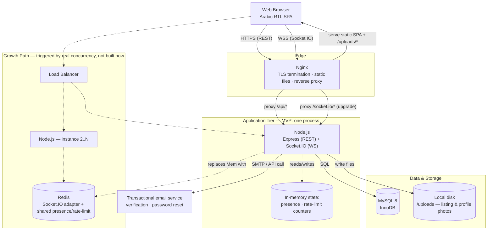

# System Architecture — Syrian Real Estate Platform

**Phase:** High-Level Architecture (builds on [Requirements v2](./requirements-and-architecture-foundations.md), [MySQL Database Design](./database-design.md), and the [API/WebSocket Contract](./api-websocket-contract.md))
**Scope:** Deployment-level component diagram and the reasoning behind it — still no application code.

---

## 1. Architecture at a Glance

The diagram below shows the MVP system as solid boxes and arrows — everything in it is what actually gets built for launch, sized for the "hundreds of users, low concurrency" target agreed in the requirements phase. The dashed **Growth Path** subgraph is *not* built now; it's included so the one real fork in the road — going from one Node.js process to several — is visible up front, along with the single new component (Redis) that fork actually requires.

*Solid = MVP, built now. Dashed = the scale-out path: adding a second Node.js instance is the trigger, and Redis is the one new component that move requires — not a speculative "just in case" addition, but the specific dependency Socket.IO needs the moment rooms have to be visible across more than one process.*

---

## 2. Component Responsibilities

| Component | Responsibility | Why this shape |
|---|---|---|
| **Nginx** | TLS termination, serves the compiled frontend SPA and `/uploads` static files directly, reverse-proxies `/api/*` to Node, and proxies the WebSocket upgrade for `/socket.io/*` | Keeping static-file and TLS work off the Node process is standard practice and free performance — Node never touches a request that doesn't need application logic |
| **Node.js (Express + Socket.IO)** | The entire application: REST handlers (§2 of the API doc), Socket.IO event handlers (§3 of the API doc), business rules (moderation, soft-cap flagging, block enforcement, exchange-rate search matching) | One process at MVP scale (NFR-SCALE-1) — no premature service-splitting for a few hundred users |
| **In-memory state (`Mem`)** | Two things that must *not* hit the database on every event: which `userId`s are currently connected (presence, NFR-SCALE-4) and the sliding-window counters for the 10-messages/10s rate limit | Both are ephemeral by nature; correct in a single process, and explicitly the thing that has to move to Redis the moment there's more than one process (see §3) |
| **MySQL 8** | System of record for everything durable: users, listings, conversations, messages, reports, audit log, exchange-rate history | As designed in the database phase — InnoDB, `utf8mb4`, `FULLTEXT ... WITH PARSER ngram` for Arabic keyword search |
| **Local disk `/uploads`** | Listing photos and profile photos, written by Node on `multipart/form-data` upload, served back out directly by Nginx | Matches your explicit choice to avoid cloud object storage for MVP; Nginx serves these so Node isn't spending event-loop time streaming static image bytes |
| **Transactional email service** | Sends the two email types the requirements actually call for: verification links and password-reset links (FR-UM-2, FR-UM-4) | Nothing else in the requirements needs email — notifications are explicitly in-app only (FR-NT-1–5) |

---

## 3. Why Redis Is the Growth Path, Not Day-One Infrastructure

This is worth spelling out because it's the one place "keep it simple for MVP" and "design for the documented growth path" (both from your own decisions) meet at a concrete technical fact rather than a judgment call:

Socket.IO rooms (`conversation:{id}`, `user:{id}`) are **held in the memory of whichever process a socket connected to.** With one Node.js instance, that's a non-issue — every connected client is in the same process's memory, so `io.to(room).emit(...)` always reaches everyone in that room. The moment a second instance is added behind a load balancer, that stops being true: two participants in the same conversation could be connected to two different instances, and a broadcast on instance A would never reach the socket sitting on instance B.

Socket.IO's answer to this is an **adapter** — `@socket.io/redis-adapter` is the standard one — which republishes room broadcasts through Redis pub/sub so every instance hears every event regardless of which one a given client is attached to. The same Redis instance is also the natural place to move the presence map and rate-limit counters once they need to be visible across processes instead of trapped in one.

That's why the growth-path box in §1 is exactly *one* component, not a speculative "add a cache layer" gesture — it's the specific, named thing that specific change requires, wired in only when concurrency actually demands a second Node.js instance.

---

## 4. Deployment Notes

- **Process management**: a single long-running Node.js process needs a supervisor to restart it on crash and on server reboot — PM2 is the common idiomatic choice for a Node/Socket.IO app and also gives basic log rotation and a `pm2 reload` path for zero-downtime deploys of a single instance.
- **Nginx WebSocket upgrade**: `/socket.io/*` needs the standard `proxy_set_header Upgrade $http_upgrade;` / `Connection "upgrade";` configuration — an easy thing to forget and the single most common cause of "chat works locally, not behind the reverse proxy" bugs.
- **Upload validation**: per NFR-SEC-5, Node re-encodes/validates every uploaded photo before it's written to `/uploads` — this also has to happen *before* Nginx would ever be asked to serve it back out.
- **Backups (NFR-AVAIL-3)**: a scheduled `mysqldump` (or MySQL's binary-log-based point-in-time approach, if you want finer recovery granularity than "last nightly dump") plus a periodic archive of the `/uploads` folder, since photos are real user data that lives outside the database entirely.
- **TLS**: terminated at Nginx; Node never sees plaintext HTTP/WS from the outside.

---

## 5. Open Questions From This Phase

1. **Hosting target**: is there a specific host/provider in mind (a VPS, a specific cloud provider, on-prem in Syria), or is that a later decision? This mostly affects deployment mechanics, not the diagram above, but it does affect things like whether outbound SMTP ports are even reachable from the box.
2. **Email provider**: any preference for the transactional email service (e.g., an SMTP relay you already have, or a provider API), or should that be picked later without blocking anything upstream of it?
3. **Backup retention**: NFR-AVAIL-3 says "regular automated backups" — what retention window feels right (e.g., 7 daily + 4 weekly), given this is a decision about acceptable data-loss exposure, not a technical constraint I should be guessing at?
4. **Domain/environment count**: just production for now, or do you also want a staging environment mirroring this same architecture at smaller scale before this goes further?

---

*This closes the four planned design phases (Requirements → Database → API/WebSocket Contract → System Architecture). Your call on what's next: start scaffolding the actual codebase against these documents, or review/revise anything above first.*
